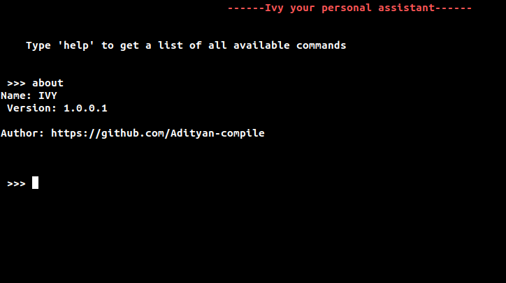

# CommandLine Assistant (IVY)

### Description:
 A simple commandline assistant (IVY) made in python and can be used to perform simple tasks.

#### Author: https://github.com/Adityan-compile

#### Version: 1.0.0.1

### Dependencies:
+ Playsound
+ Python 3.x
+ Pip version:3

### Commands:
+ sing a song 
+ tell me a story 
+ web browser
+ youtube
+ facebook
+ instagram
+ github
+ twitter
+ linkedin
+ netflix           
+ soundcloud
+ imdb
+ amazon
+ ebay
+ weather
+ quora
+ google meet
+ gmail
+ About
+ Exit

### Warning:

+ The response sounds are created by using an online text to speech tool therefore limiting the functionality of the assistant.

### screenshot:

